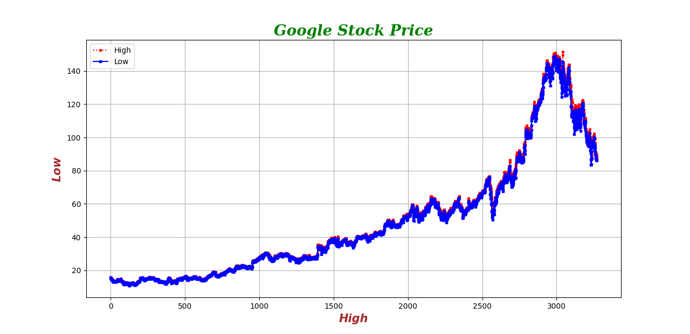

# Data-analysis_visualization🔬

## GOOGLE STOCK MARKET RATES🎯

This project focuses on the comprehensive analysis and visualization of Google's stock market rates for 2023, leveraging powerful Python libraries for data handling and graphical representation [i].
Project Overview & Key Learnings
The core of this project involved gathering and visualising the dataset of Google Stock rates (2023) using key Python Libraries: Pandas, NumPy, and Matplotlib [i]. Through this process, I gained practical expertise in several critical areas [i]:
•

## Data Acquisition and Management: 
* Learning how to obtain datasets via the Pandas library and convert them into CSV files [i].
•
## Numerical Operations:📑 
* Applying various numerical functions through the NumPy library [i].
•
## Data Visualisation:📉
* Mastering the visualisation of imported datasets using diverse graphical functions provided by Matplotlib, including [i]:
◦
Line plots [i]
◦
Scatter plots [i]
◦
Histograms [i]
◦
Density plots [i]
◦
Subplots [i]
◦
Bar charts [i]
◦
Pie charts [i]
•
## Customization and Enhancements:

 Exploring and applying various attributes and arguments to refine visualisations, such as markers, linestyle, fontsize, grid, legend, facecolor, color, labels, titles, fontstyle, fontweight, and saving figures [i].

## Tech Stacks & Libraries Used

This project heavily relies on the following technologies and libraries for its implementation [i]:
•
## Tech Stack:🐍

Python 3.13.7 [i]
•
### Libraries Used:🎒

 *Pandas: For data manipulation and analysis, including reading datasets and converting them to CSV format.
 *NumPy: For numerical operations and mathematical functions [i].
 *Matplotlib: For creating static, animated, and interactive visualisations in Python, specifically used for line plots and scatter plots, among other graph types [I].

Google Stock Performance Analysis🚡
Based on the visual representation of Google's stock price over a period, the following key observations can be made:

Overall Trend: Long-term Growth Followed by a Sharp Decline: The graph illustrates that Google's stock price experienced a period of sustained long-term growth, which was subsequently followed by a significant decline.

## Importance of Python libraries.📚

The project on Google stock market rates heavily leverages several powerful Python libraries for data handling and graphical representation. These libraries are fundamental to the implementation and analysis within this project.
The primary Python libraries utilised are:
•
Pandas: This library is crucial for data manipulation and analysis. Within this project, Pandas was specifically used for obtaining datasets and converting them into CSV files. It plays a key role in the data acquisition and management phase.
•
NumPy: Employed for numerical operations and mathematical functions. The project specifically applied various numerical functions through the NumPy library.
•
Matplotlib: This library is central to creating static, animated, and interactive visualisations in Python. It was used to master the visualisation of imported datasets through diverse graphical functions. Specific types of visualisations created using Matplotlib in this project include:
◦
Line plots
◦
Scatter plots
◦
Histograms
◦
Density plots
◦
Subplots
◦
Bar charts
◦
Pie charts 🎡
Furthermore, Matplotlib allowed for customisation and enhancements of these visualisations by exploring and applying various attributes and arguments, such as markers, linestyle, fontsize, grid, legend, facecolor, color, labels, titles, fontstyle, fontweight, and saving figures.
Discuss Google stock analysis.

◦
 #### Google Stock Price:
  Overall Trajectory Indicating Initial Growth and Subsequent Sharp Downturn
•
#### Steady Growth Phase: 
For a considerable portion of the timeline, the stock price demonstrated consistent and steady growth. This phase reflected strong company performance and robust investor confidence.

 "Phase 1: Consistent Growth Reflecting Strong Company Performance and Investor Confidence"
•
#### Sharp Rise (Rapid Price Surge): 
In the latter part of the timeline, there was a steep upward spike, indicating a rapid price surge. This surge might have been triggered by major positive events or a period of high market optimism.
◦
Phase 2: Rapid Price Surge – A Steep Upward Spike Indicating Market Optimism
•
#### Sudden Drop (Significant Price Decline): 
Following its peak, the stock prices experienced a significant fall. This decline could signal a market correction, the impact of external shocks, or specific issues related to the company.
◦
Phase 3: Post-Peak Decline – Signalling Market Correction or External Factors
•
#### Increased Volatility During Peak Periods: 
The graph also shows that the gap between high and low prices widened during peak periods, indicating increased market volatility.
◦
#### Market Volatility: Wider Price Swings Observed During Peak Stock Periods
•
Current Downward Trend (Investor Caution): The movement observed at the end of the timeline suggests a current downward trend. This may signal caution in the market or a decline in overall investor sentiment.
◦
#### Current Trend: 
Downward Movement Indicating Market Caution and Declining Investor Sentiment

•
## Google Stock Analysis: Insights and Trends 🎓

These observations collectively describe Google's stock as having experienced a "Volatile Journey", moving from periods of strong growth and surges to significant declines and increased volatility.
1- This graph shows that Google's stock price experienced long-term growth followed by a sharp decline:

2- Steady Growth Phase: For a large portion of the timeline, the stock steadily increased, reflecting strong company performance and investor confidence.

3- Sharp Rise: There’s a steep upward spike in the latter part, indicating a rapid price surge—possibly due to major positive events or high market optimism.

4- Sudden Drop: After peaking, the prices fall significantly, signaling a market correction, external shocks, or company-specific issues.

5- Volatility: The gap between the high and low prices also widens during peak periods, showing increased market volatility.

6- Current Trend: The downward movement at the end suggests caution in the market or declining investor sentiment.

    Overall, the graph tells a story of strong past performance with recent instability in Google’s stock.
    

* **Key Takeaways:** 📦
* Google's stock price has experienced long-term growth followed by a sharp decline.
* The stock price has shown steady growth for a large portion of the timeline.
* There was a steep upward spike in the latter part of the timeline, indicating a rapid price surg.
* The stock price has fallen significantly after peaking, signaling a market correction or company-specific issues.
* The graph shows increased market volatility during peak periods.
* The current trend suggests caution in the market or declining investor sentiment.

The link of the graph is: 

In the image of a scatter plot & line plot, it also describes a stock market graph detailing the performance of Google's stock price. It explains that the stock initially demonstrated consistent growth, indicative of strong company performance, before experiencing a rapid surge at a later point. Following this peak, a significant price decline occurred, suggesting a market correction or other contributing factors. The analysis also highlights increased volatility during periods of high prices and notes a current downward trend, which may signal investor caution. 🛠💼
